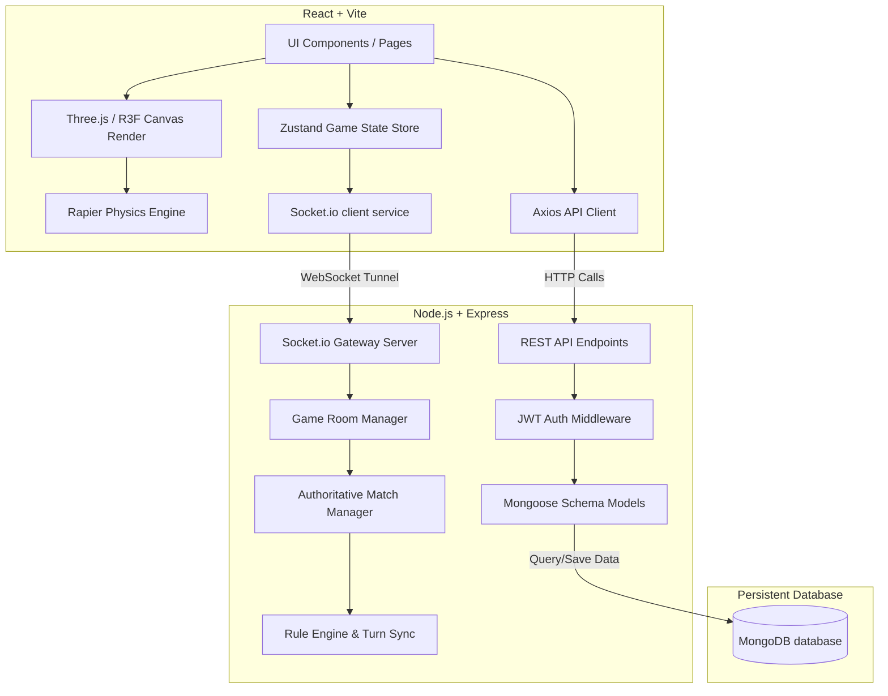

# 🎱 8-Pool Multiplayer Game

A premium, modern multiplayer 8-Ball Pool game built with high-fidelity 3D graphics, realistic physics simulation, real-time synchronization, and a robust client-server architecture.

---

## 📖 Project Overview

This project is a full-stack, authoritative-server multiplayer 8-Ball Pool game. It is structured as a monorepo containing a shared types package, a React client utilizing **Three.js** via **React Three Fiber (R3F)** for immersive visual gameplay, and a Node.js/Express server that runs authoritative match validations and manages active game rooms via **Socket.IO**.

---

## 🚀 Key Features

* **Authoritative Server Turn & Physics Sync**: Relays aiming angles, strikes, pockets, and fouls securely with client-side visual replication.
* **3D Visuals & Shader Effects**: Premium 3D felt bed table, rails, and spheres with specular reflections, ball trails, collision bursts, and confetti particle effects.
* **Tournament System**: 4-player automated knockout tournament with bracket generation, semi-finals, finals, and real-time socket updates.
* **Achievements Tracking**: Tracks user performance metrics authoritatively on match conclusion, unlocking achievements like *First Win*, *Break Master*, *Perfect Game*, or *Combo King*.
* **Comprehensive Game Settings**: Fully-functional page allowing custom controls over master music/sfx volumes, graphics resolution, shadow map quality, FPS capping (30/60/unlimited), UI themes (Dark, Light, Neon), and localization (English, Spanish, French, German).
* **Code-Splitting & Lazy Loading**: Dynamic route splitting of chunk bundles, displaying a custom loading screen during transitions to maximize performance.
* **Network & Error Boundaries**: A global React error boundary to catch graphics/runtime crashes with visual fallback error tracing, alongside a top-bar banner to notify users of network disconnects and auto-reconnect.

---

## 📐 Architecture Diagram

Below is the conceptual layout of the application's client-server architecture:



---

## 🛠️ Tech Stack

### 1. Client
* **Core**: React, TypeScript, React Router Dom (v6)
* **3D & Physics**: Three.js, React Three Fiber (R3F), `@react-three/drei`, `@react-three/rapier`
* **State Management**: Zustand
* **Animations**: GSAP (GreenSock)
* **Real-time Sync**: Socket.io-client
* **Styles**: Tailwind CSS

### 2. Server
* **Runtime**: Node.js, Express, TypeScript
* **Database**: MongoDB (Mongoose ODM)
* **Real-time Gateway**: Socket.IO
* **Authentication**: JWT, bcryptjs

### 3. Shared
* **Shared Workspace**: Common TypeScript models, match states, and event schemas shared across client and server.

---

## 📁 Folder Structure

```
8-Pool/
├── client/                 # React frontend application
│   ├── src/
│   │   ├── audio/          # Sound Effects & Music managers
│   │   ├── components/     # UI widgets (PlayerCard, GameLoader, etc.)
│   │   ├── errors/         # ErrorBoundary, ErrorPage, NetworkError
│   │   ├── game/           # ThreeJS Scene, Balls, PoolTable, Controls
│   │   ├── hooks/          # Custom hooks (useTranslation, etc.)
│   │   ├── pages/          # Layout Pages (Dashboard, Settings, Game)
│   │   └── store/          # Zustand global state stores
│   └── tailwind.config.js
├── server/                 # Express REST API & WebSocket server
│   ├── src/
│   │   ├── models/         # User and Room mongoose models
│   │   ├── routes/         # Express endpoints routing
│   │   ├── services/       # Database business operations
│   │   └── socket/         # Authoritative Match, Physics & Socket handlers
│   └── package.json
└── shared/                 # Shared TypeScript models & configurations
```

---

## ⚙️ Installation Guide

### Prerequisites
* **Node.js** (v18 or higher recommended)
* **MongoDB** (Running locally or a MongoDB Atlas URI string)

### Setup Steps
1. **Clone the repository** and navigate to the project directory.
2. **Install all dependencies** from the monorepo root:
   ```bash
   npm install
   ```
3. **Configure Environment Variables** (see section below).
4. **Build the shared library**:
   ```bash
   npm run build:shared
   ```
5. **Run the development servers**:
   * To start both the client and server concurrently:
     ```bash
     # Terminals
     npm run dev:server
     npm run dev:client
     ```

---

## 🔑 Environment Variables

Create `.env` files in both backend and frontend workspaces to hook databases and API networks:

### Server Environment (`server/.env`)
```env
PORT=5000
MONGO_URI=mongodb://localhost:27017/eight_pool
JWT_SECRET=your_jwt_signing_token_secret_phrase
```

### Client Environment (`client/.env`)
```env
VITE_API_URL=http://localhost:5000
```

---

## 🖼️ Game Interface & Visuals

The client app is designed with a premium, glassmorphic UI containing neon glow borders and fluid animations:

### 1. Match Hub & Lobby
* Browse active public queue rooms.
* Quick-join matches by code keys or create private rooms.
* User progression levels, rank statuses, and rewards balances.

### 2. Interactive Settings
* Custom volume sliders.
* Responsive visual rendering and FPS cap switches.
* Localization translations instantly adapting the layout language.

### 3. Gameplay Render (Scene)
* Autorotating cue stick guides.
* Staggered particle explosions when pool balls are pocketed.
* Confetti burst animations upon victory screens.

---

## 🏆 Feature Specifications

### 🏆 Tournament System
Allow multiple players to participate.

**Flow:**
```
Tournament
    ↓
Register Players
    ↓
Generate Bracket
    ↓
Semi Final
    ↓
Final
    ↓
Champion
```

**Backend Models:**
`Tournament` | `Match` | `Round` | `Bracket` | `Winner`

---

### 👥 Friend System
Players can:
* Add Friends
* Remove Friends
* Invite Friends
* Online Status
* Recently Played

**Database Schema (`Friend`):**
`user1` | `user2` | `status` | `createdAt`

---

### 💬 Global Chat System
Instead of only room chat.

**Channels:**
* `Lobby Chat`
* `Game Chat`
* `Private Chat`

**Socket Events:**
`join-global-chat` | `leave-global-chat` | `private-message` | `typing` | `online-users`

---

### 📹 Spectator Mode
A third person can join.

**Room Roles:**
`Player 1` | `Player 2` | `Spectator 1` | `Spectator 2`

**Spectator Rules:**
* Cannot shoot
* Cannot chat during ranked games (optional)
* Can watch live real-time physics & aiming sync

---

### 📺 Match Replay System
Record and playback every shot sequence of completed matches.

**Replay Structure:**
`Shot 1` -> `Shot 2` -> `Shot 3` -> ... -> `Winner`

**Replay Features:**
* Save full shot sequence (shooter, aiming angle, shot power, initial ball positions snapshot)
* Interactive step-by-step or automatic 3D replay playback
* Accessible from User Profile & Replay Library

---

### 🎮 Practice Mode
Offline single-player training mode for learning and shot practice.

**Practice Features:**
* Offline play (no server socket required)
* Unlimited shots & zero turn timers
* Reset balls & rack at any time
* Instant Ball-in-Hand placement anywhere on table
* Good for learning cue angles, bank shots, and power control

---

### 🤖 AI Opponent
Single-player vs AI Bot match with configurable difficulty.

**Difficulties:**
* `Easy`: High angular error, casual shot power
* `Medium`: Direct target ball & pocket physics heuristic
* `Hard`: High precision collision vector targeting & optimal speed

**AI Features:**
* Uses physics collision heuristics to identify valid target balls and line-of-sight pockets
* Automatic turn execution with smooth aiming animation

---

### 🌏 Matchmaking & ELO Rating System
Rank-based automated quick matchmaking and skill rating engine.

**Matchmaking Flow:**
`Quick Match` -> `Find Player` -> `Match Same Rank/ELO` -> `Auto-Join Game Room`

**ELO Rating Rules:**
* Default rating: 1200 ELO
* Standard Esports K-Factor formula ($K = 32$)
* Rank Tiers: Bronze (<1100), Silver (1100-1300), Gold (1300-1500), Platinum (1500-1700), Diamond (1700-1900), Master (1900+)

---

### 🏅 Competitive Ranking System
Dynamic post-match rank tier progression engine.

**Rank Tiers:**
* 🥉 `Bronze`: < 1100 ELO
* 🥈 `Silver`: 1100 - 1299 ELO
* 🥇 `Gold`: 1300 - 1499 ELO
* 💠 `Platinum`: 1500 - 1699 ELO
* 💎 `Diamond`: 1700 - 1899 ELO
* 👑 `Master`: 1900+ ELO

**Ranking Features:**
* Automatic post-match rank evaluation & database update after every game
* Real-time rank promotion / demotion notifications & tier progress bar

---

### 💰 Shop & Inventory System
In-game store and item management engine.

**Categories:**
* `Cue Sticks`: Standard, Neon Cyber, Dragon Blaze, Royal Gold, Void Phantom
* `Table Felts`: Classic Green, Cyber Neon Blue, Royal Purple Velvet, Crimson Passion Red
* `Avatars`: Maverick, Cyberpunk, Pool Shark, Royal Crown, Golden Lion
* `Emotes`: 😎 Cool, 🚀 Rocket, 💥 Boom, 👑 Crown, 🔥 Fire
* `Victory Effects`: Confetti Fireworks, Neon Laser Pulse, Victory Flame Streamer

**Inventory Features:**
* Coin-based item purchasing & coin balance deduction
* Owned items collection database storage
* Real-time item equipping and active customization

---

### 🎁 Daily Rewards System
7-day login streak reward calendar.

**Reward Progression:**
* `Day 1`: 100 Coins
* `Day 2`: 150 Coins
* `Day 3`: 200 Coins
* `Day 4`: 300 Coins + 100 XP
* `Day 5`: 500 Coins
* `Day 6`: 750 Coins + 250 XP
* `Day 7`: 1,500 Coins + 👑 **Legendary Cue**

**Daily Features:**
* Automated daily login streak tracking & reset after missing a day
* Popup calendar modal on dashboard login with one-click claim

---

### 📱 Responsive Mobile Support
Comprehensive mobile touch controls and adaptive HUD layout engine.

**Mobile Enhancements:**
* `Touch Aiming`: Intuitive single-finger 3D table drag gesture aiming with dampening
* `Responsive HUD`: Adaptive compact top bar for player avatars, turn status, and timers
* `Landscape Mode`: Device orientation detector with landscape recommendation overlay
* `Mobile Controls`: Fine-tune angle micro-adjustment buttons, touch power slider, and quick presets

---

### 🌎 Internationalization (i18n)
Multi-language support for international players.

**Supported Languages:**
* 🇺🇸 `English`: Full UI localization & default language
* 🇮🇳 `Hindi (हिंदी)`: Devanagari translation for game controls, shop, and dashboard
* 🇪🇸 `Spanish (Español)`: Spanish localization for competitive modes and menus
* 🇫🇷 `French (Français)`: French localization for settings and HUD badges

---

### 🔒 Backend Security Improvements
Production-grade enterprise security architecture.

**Security Features:**
* `Helmet`: Comprehensive HTTP security headers (CSP, HSTS, X-Frame-Options, XSS protection)
* `Rate Limiting`: DDoS protection and strict IP rate limiters on auth & API endpoints
* `Input Validation`: Strict schema validation for emails, passwords, and room payloads
* `Sanitization`: Automatic XSS escaping and Mongo operator injection prevention
* `HTTPS`: Secure cookies, HSTS headers, and HTTPS enforcement
* `Refresh Tokens`: Dual JWT token architecture (Short-lived 15m Access Token + 7d Refresh Token)

---

### 🐳 Docker & Containerization
Single-command production deployment infrastructure.

**Containerized Stack:**
* `Frontend`: React Vite container with Nginx web server
* `Backend`: Express.js Node.js server container
* `MongoDB`: Official MongoDB 7.0 database container with volume persistence
* `Redis`: Official Redis 7 Alpine cache container for socket session caching

**Deployment Command:**
```bash
docker compose up
```

---

### ⚙️ CI/CD Pipeline (GitHub Actions)
Automated continuous integration & continuous deployment pipeline.

**Pipeline Flow:**
`Push / PR` -> `Install Dependencies` -> `Test Verification` -> `Build Production Bundles` -> `Deploy Container Artifacts`

**Automated Jobs:**
* Setup Node.js 20 & npm cache
* Type-check verification for server & client TypeScript code
* Production build execution (`npm run build`)
* Docker image build validation for frontend & backend

---

### 📊 Monitoring & Observability
System telemetry, error logging, and performance metrics.

**Monitoring Capabilities:**
* `Sentry`: Production error tracking & exception capture integration wrapper
* `Logging`: Structured logger with timestamps, log levels, request context, and error stacks
* `Health Checks`: Detailed `/health` and `/health/liveness` REST endpoints reporting MongoDB status, uptime, and memory usage
* `Performance Metrics`: Execution response time measurement (`X-Response-Time` header) and memory usage profiling

---

### 📂 Feature-Sliced Architecture (`features/`)
Domain-driven feature module organization.

**Feature Subdirectories (`features/`):**
* 🏆 `tournaments/`: Tournament bracket manager, elimination trees, and knockout mode state
* 📺 `replay/`: Shot snapshot recorder, replay player controls, and 3D match playback
* 🤖 `ai/`: Physics collision solver, bot difficulty levels, and single-player AI agent
* 🛍️ `shop/`: Cosmetic catalog, coin store, and inventory equipment manager
* 📈 `analytics/`: Player telemetry tracker, match accuracy metrics, and win-rate statistics
* ⚡ `matchmaking/`: Rank-proximity matchmaking queue, ELO solver, and radar modal

---

## 🔮 Future Improvements Roadmap

* [x] **Friend System**: Full implementation of Friend model, friend requests, online status tracking, and direct match invites.
* [x] **Global Chat System**: Comprehensive multi-channel chat engine featuring Lobby Chat, Game Chat, Direct Private Messaging, Typing Indicators, and Online User lists.
* [x] **Spectator Mode**: Support for third-party room spectators with real-time frame sync and shoot permissions disabled.
* [x] **Match Replay System**: Full shot-by-shot match recording and interactive 3D playback viewer.
* [x] **Practice Mode**: Comprehensive offline practice arena with rack reset, ball placement, and shot training HUD.
* [x] **AI Opponent**: Single-player matches vs AI Bot with Easy, Medium, and Hard difficulty levels.
* [x] **Matchmaking & ELO Rating System**: Automated rank-proximity matchmaking queue with real-time ELO rating updates.
* [x] **Competitive Ranking System**: Dynamic post-match rank tier progression ladder with promotion modals & tier progress.
* [x] **Shop & Inventory System**: Coin-based store catalog for Cues, Tables, Avatars, Emotes, and Victory Effects with inventory equipping.
* [x] **Daily Rewards System**: 7-day consecutive login reward calendar awarding coins, XP, and legendary cues.
* [x] **Responsive Mobile Support**: Touch aiming gestures, responsive game HUD, portrait/landscape orientation prompts, and fine mobile power controls.
* [x] **Internationalization**: 4-language i18n engine (English, Hindi, Spanish, French) with quick language selector.
* [x] **Backend Security Improvements**: Helmet HTTP headers, IP rate limiters, input sanitization, HTTPS security, and JWT refresh tokens.
* [x] **Docker Containerization**: Multi-container Docker Compose setup for Frontend, Backend, MongoDB, and Redis with single command `docker compose up`.
* [x] **CI/CD Pipeline**: GitHub Actions workflow for push triggers, dependency install, test verification, production builds, and container deployment.
* [x] **Monitoring & Observability**: Sentry error tracking wrapper, structured logger, health checks with DB status, and performance metrics.
* [x] **Feature-Sliced Architecture**: Domain-driven feature directory (`features/` containing tournaments, replay, ai, shop, analytics, matchmaking).
* [ ] **Authoritative WebAssembly Physics**: Fully bundle Rapier3D WASM into Node.js server loop for complete physics authoritative simulation frame-by-frame.
* [ ] **Match Chat System Extensions**: Integrate quick-emoji updates and customized pre-written short chat scripts.
