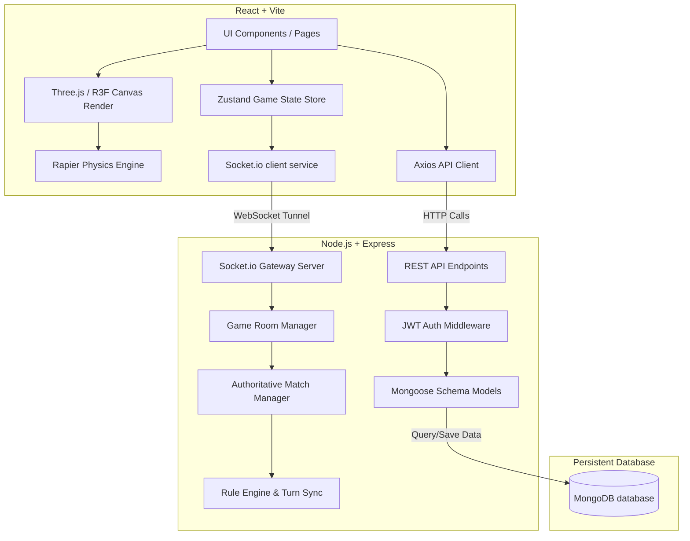

# 🎱 8-Pool Multiplayer Game

A premium, modern multiplayer 8-Ball Pool game built with high-fidelity 3D graphics, realistic physics simulation, real-time synchronization, and a robust client-server architecture.

---

## 📖 Project Overview

This project is a full-stack, authoritative-server multiplayer 8-Ball Pool game. It is structured as a monorepo containing a shared types package, a React client utilizing **Three.js** via **React Three Fiber (R3F)** for immersive visual gameplay, and a Node.js/Express server that runs authoritative match validations and manages active game rooms via **Socket.IO**.

---

## 🚀 Key Features

* **Authoritative Server Turn & Physics Sync**: Relays aiming angles, strikes, pockets, and fouls securely with client-side visual replication.
* **3D Visuals & Shader Effects**: Premium 3D felt bed table, rails, and spheres with specular reflections, ball trails, collision bursts, and confetti particle effects.
* **Achievements Tracking**: Tracks user performance metrics authoritatively on match conclusion, unlocking achievements like *First Win*, *Break Master*, *Perfect Game*, or *Combo King*.
* **Comprehensive Game Settings**: Fully-functional page allowing custom controls over master music/sfx volumes, graphics resolution, shadow map quality, FPS capping (30/60/unlimited), UI themes (Dark, Light, Neon), and localization (English, Spanish, French, German).
* **Code-Splitting & Lazy Loading**: Dynamic route splitting of chunk bundles, displaying a custom loading screen during transitions to maximize performance.
* **Network & Error Boundaries**: A global React error boundary to catch graphics/runtime crashes with visual fallback error tracing, alongside a top-bar banner to notify users of network disconnects and auto-reconnect.

---

## 📐 Architecture Diagram

Below is the conceptual layout of the application's client-server architecture:



---

## 🛠️ Tech Stack

### 1. Client
* **Core**: React, TypeScript, React Router Dom (v6)
* **3D & Physics**: Three.js, React Three Fiber (R3F), `@react-three/drei`, `@react-three/rapier`
* **State Management**: Zustand
* **Animations**: GSAP (GreenSock)
* **Real-time Sync**: Socket.io-client
* **Styles**: Tailwind CSS

### 2. Server
* **Runtime**: Node.js, Express, TypeScript
* **Database**: MongoDB (Mongoose ODM)
* **Real-time Gateway**: Socket.IO
* **Authentication**: JWT, bcryptjs

### 3. Shared
* **Shared Workspace**: Common TypeScript models, match states, and event schemas shared across client and server.

---

## 📁 Folder Structure

```
8-Pool/
├── client/                 # React frontend application
│   ├── src/
│   │   ├── audio/          # Sound Effects & Music managers
│   │   ├── components/     # UI widgets (PlayerCard, GameLoader, etc.)
│   │   ├── errors/         # ErrorBoundary, ErrorPage, NetworkError
│   │   ├── game/           # ThreeJS Scene, Balls, PoolTable, Controls
│   │   ├── hooks/          # Custom hooks (useTranslation, etc.)
│   │   ├── pages/          # Layout Pages (Dashboard, Settings, Game)
│   │   └── store/          # Zustand global state stores
│   └── tailwind.config.js
├── server/                 # Express REST API & WebSocket server
│   ├── src/
│   │   ├── models/         # User and Room mongoose models
│   │   ├── routes/         # Express endpoints routing
│   │   ├── services/       # Database business operations
│   │   └── socket/         # Authoritative Match, Physics & Socket handlers
│   └── package.json
└── shared/                 # Shared TypeScript models & configurations
```

---

## ⚙️ Installation Guide

### Prerequisites
* **Node.js** (v18 or higher recommended)
* **MongoDB** (Running locally or a MongoDB Atlas URI string)

### Setup Steps
1. **Clone the repository** and navigate to the project directory.
2. **Install all dependencies** from the monorepo root:
   ```bash
   npm install
   ```
3. **Configure Environment Variables** (see section below).
4. **Build the shared library**:
   ```bash
   npm run build:shared
   ```
5. **Run the development servers**:
   * To start both the client and server concurrently:
     ```bash
     # Terminals
     npm run dev:server
     npm run dev:client
     ```

---

## 🔑 Environment Variables

Create `.env` files in both backend and frontend workspaces to hook databases and API networks:

### Server Environment (`server/.env`)
```env
PORT=5000
MONGO_URI=mongodb://localhost:27017/eight_pool
JWT_SECRET=your_jwt_signing_token_secret_phrase
```

### Client Environment (`client/.env`)
```env
VITE_API_URL=http://localhost:5000
```

---

## 🖼️ Game Interface & Visuals

The client app is designed with a premium, glassmorphic UI containing neon glow borders and fluid animations:

### 1. Match Hub & Lobby
* Browse active public queue rooms.
* Quick-join matches by code keys or create private rooms.
* User progression levels, rank statuses, and rewards balances.

### 2. Interactive Settings
* Custom volume sliders.
* Responsive visual rendering and FPS cap switches.
* Localization translations instantly adapting the layout language.

### 3. Gameplay Render (Scene)
* Autorotating cue stick guides.
* Staggered particle explosions when pool balls are pocketed.
* Confetti burst animations upon victory screens.

---

## 🔮 Future Improvements Roadmap

* [ ] **Authoritative WebAssembly Physics**: Fully bundle Rapier3D WASM into Node.js server loop for complete physics authoritative simulation frame-by-frame.
* [ ] **Match Chat System Extensions**: Integrate quick-emoji updates and customized pre-written short chat scripts.
* [ ] **Cue Stick Shop & Skins**: Support coin-based purchases for custom aiming guidelines and visual stick cues.
* [ ] **Daily Challenges**: Introduce randomized target pocket shots and reward multipliers.
